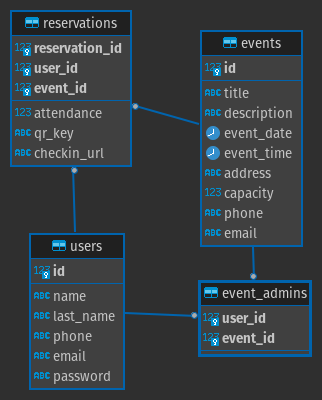

# [hold-my-spot](https://hold-my-spot.herokuapp.com/) - https://hold-my-spot.herokuapp.com/
GA - SEI Project 2: CRUD Reservation system
---

### Goal
**Short term**
- Create an event reservation system to facilitate reservation management, and access control to events

**Long term**
- Create a SaaS application for event management to handle recurring event scheduling, subscription payments, sms and email notifications

---

### Technical Requirements:
- [x] At least 2 tables in DB
- [x] Login screen/Sign up
- [x] Modify/Add data to the DB
- [x] Dashboard showing upcoming Events(For admins, it allows management of the event and adding walk-ins
- [x] Hosted online 

---
### SQL Tables needed:
- users table: Stores users and passwords along with contact information
- events table: Stores the event data
- event_admin table: Stores Admins to the events
- reservations table: Stores the attendees of the events

#### Entity Relationship Diagram:

---
### User stories

* **Event planner:**
  * Joseph is hosting a master class for 15 attendees on March 13 2022
  * Joseph creates an account and logs in, then creates the event providing:
    * Title
    * Description
    * Capacity (seats available)
    * Date
    * Time
    * Address
    * Email address (for information)
    * Phone number (for information)
  * Joseph now can add the users manually to the event, or grab the "registration URL" and post it on his website or send it via email
  * Joseph can also decide to edit the event to add more seats
  * On the day of the event, he can review the attendee list to make sure all the seats are reserved and add walk-ins manually

* **Attendee:**
  * Mike saw the event information on a website and grabbed the "registration URL"
  * On the registration URL, he registered as a guest
  * Once registered he was shown the registration confirmation
  * On the day of the event, he can click on check-in once he has arrived to the event

---

### Technologies Used
* Python Flask - For the back end framework and Front end views
* Postgres - To store persistent data related to the events and users
* JavaScript - For some of the interactivity in the application
* Heroku - Web application hosting

---

### Installation Instructions

> Installation instructions assume the basic setup has been satisfied:
> * Python3
> * Postgresql

**Environment setup**
- Clone the repository locally
- Create Python3 Virtual Environment `python3 -m venv env`
- Activate the environment `source /env/bin/activate`
- Install the dependencies `pip3 install -r requirements.txt`

**Database setup**
- Create database hold-my-spot `createdb hold-my-spot`
- Connect to the database using your favorite DB editor or command line
- Execute the DDL statements in `schema.sql` to create the required tables

**Starting the application**
- Execute `flask run`

---

### Roadmap
There are many features and cosmetic things to fix:
* Add feedback messages for basic errors
* Add validation of fields
* QR codes for validation
* JavaScript http requests to enhance interactivity
* many more to come...